# Ubuntu

以下示例均在 Ubuntu 24.04.3 LTS 测试通过。

## 安装 Ubuntu

选择 Try or Install Ubuntu Server，进入 Ubuntu 安装向导

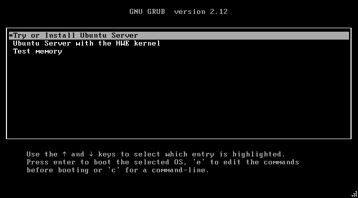

选择 English，配置安装向导语言

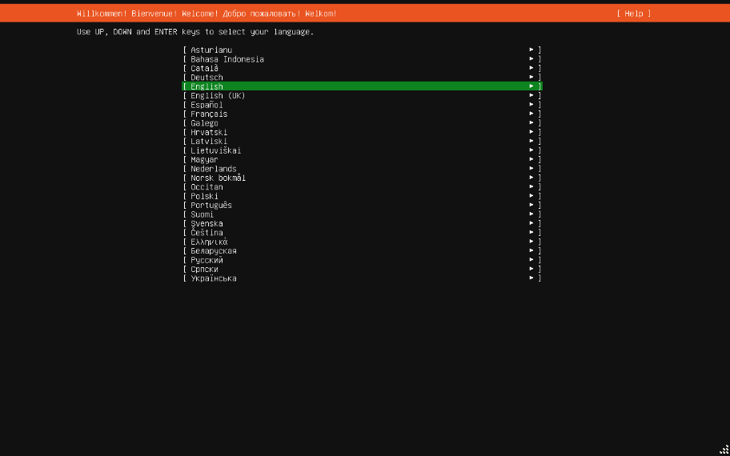

选择 Continue without updating，不更新继续安装

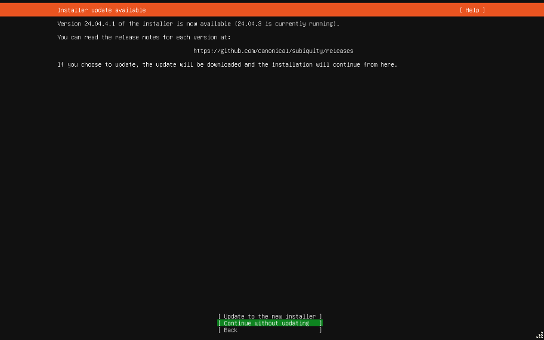

配置键盘布局后，选择 Done 下一步

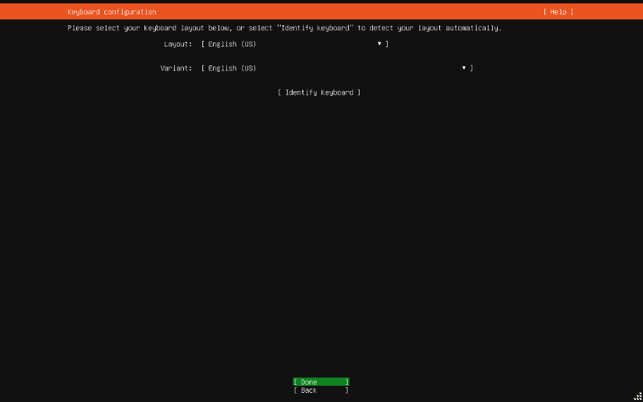

配置安装类型后，选择 Done 下一步

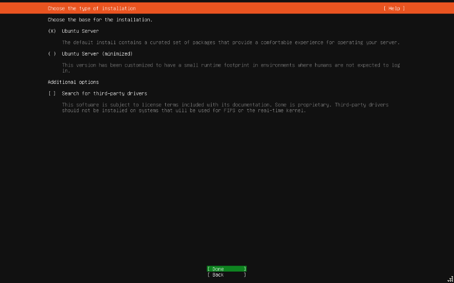

配置网络后，选择 Done 下一步

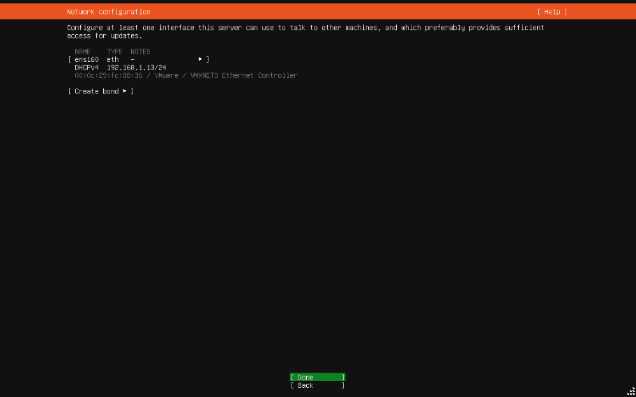

配置代理后（可不配置），选择 Done 下一步

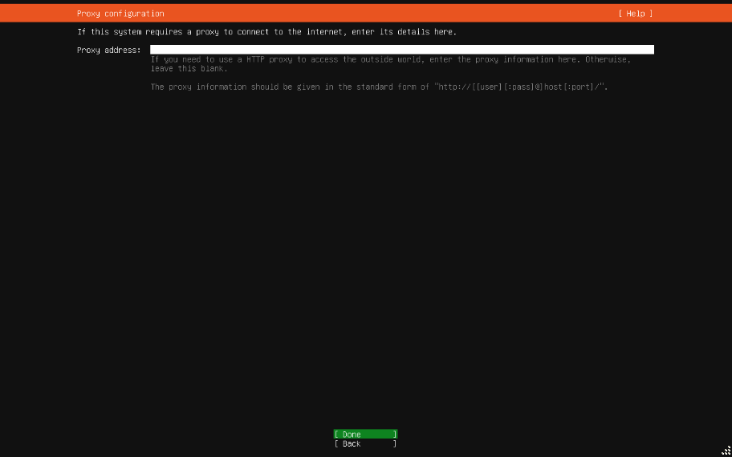

配置镜像后（可不配置），选择 Done 下一步

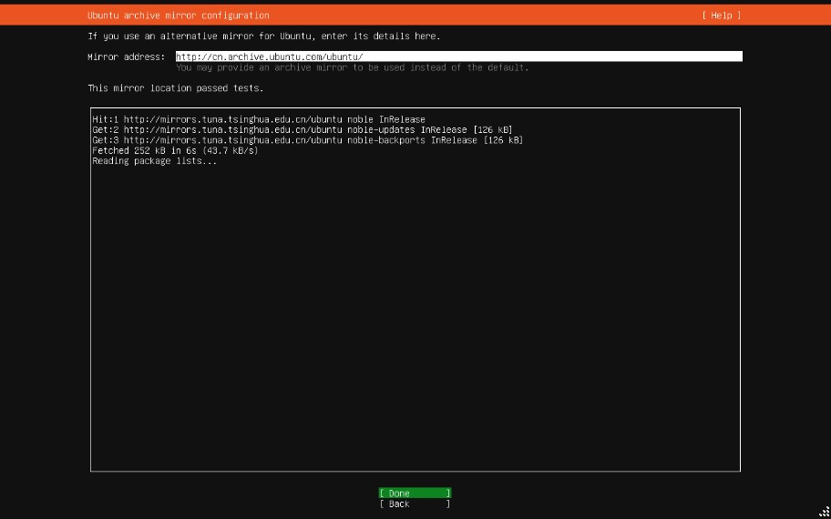

配置磁盘后，选择 Done 下一步

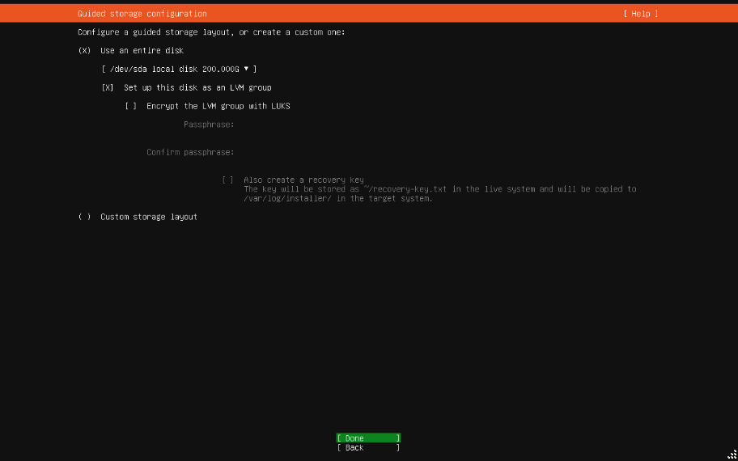

配置挂载点后，选择 Done 下一步

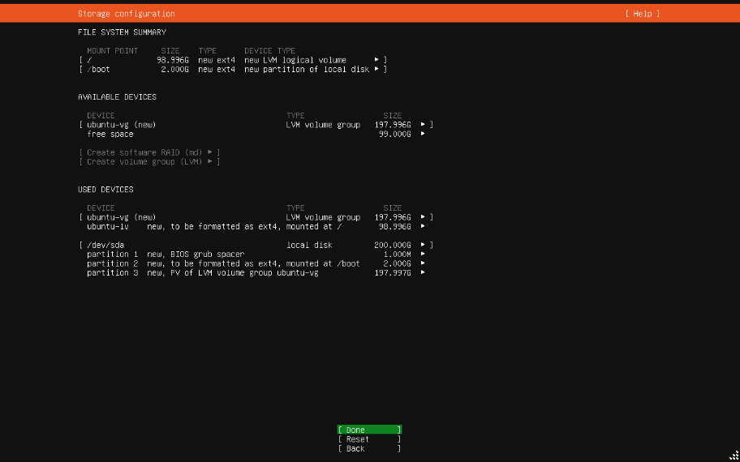

选择 Continue，确认格式化磁盘继续安装

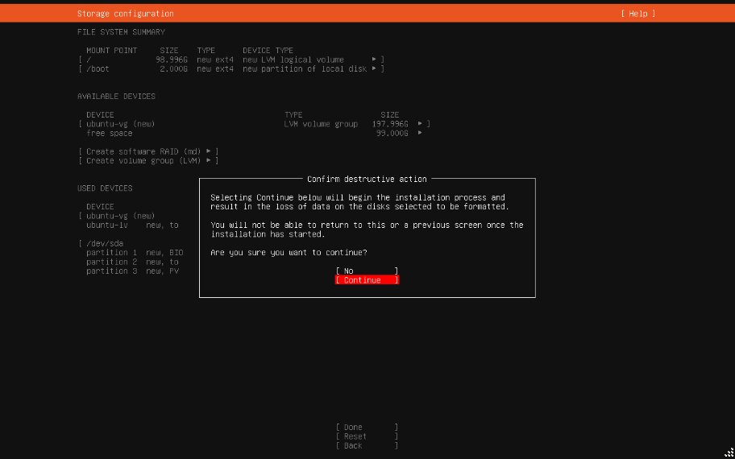

配置主机与用户信息后，选择 Done 下一步

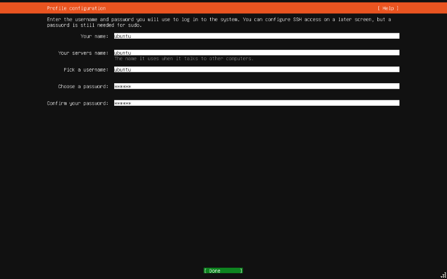

确认是否升级到 Ubuntu Pro 后，选择 Continue 继续安装

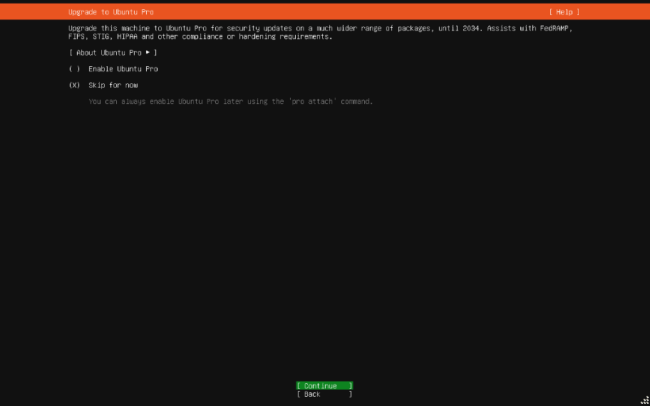

配置 SSH 后（建议勾选 Install OpenSSH server 安装 OpenSSH），选择 Done 下一步

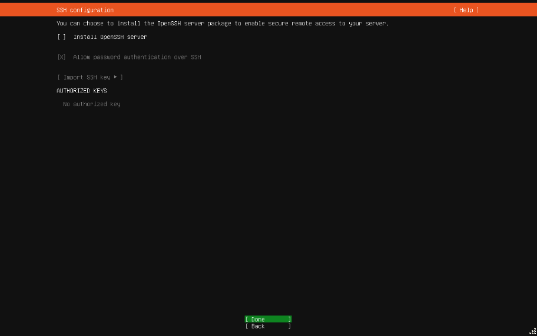

配置应用程序后，选择 Done 下一步

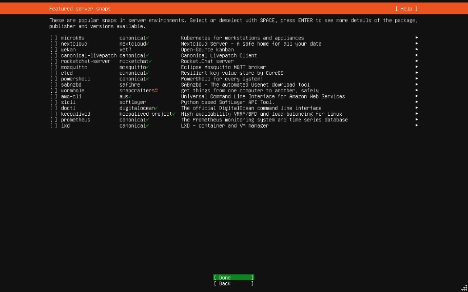

等待安装...

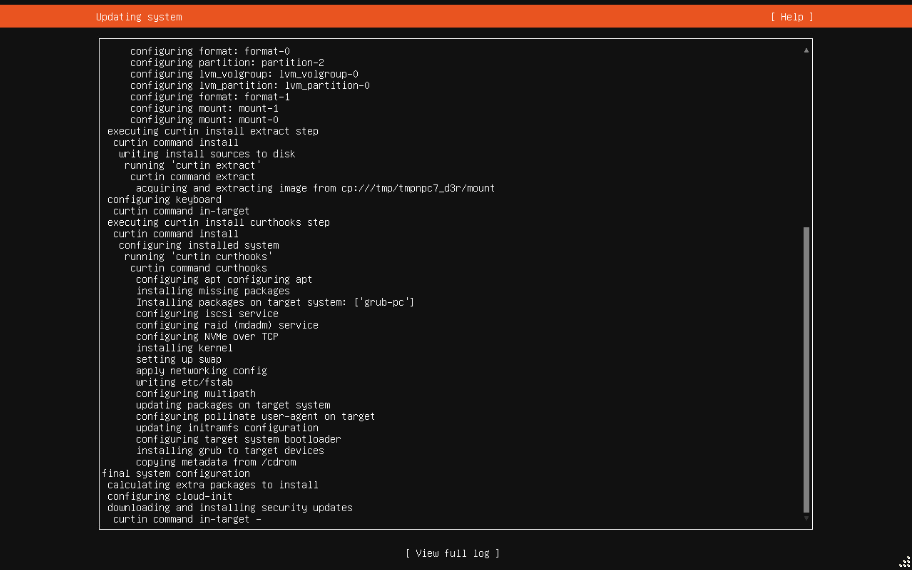

安装完成后，选择 Reboot Now 重启 Ubuntu

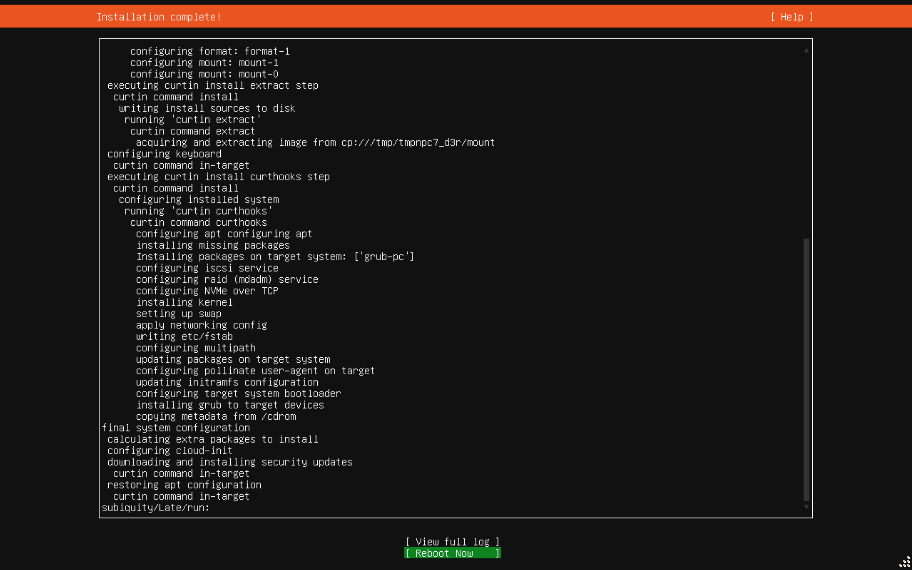

## 配置静态 IP

配置静态 IP 可为你的设备在网络中设置一个永久、固定的地址，让其他设备能稳定可靠地找到并访问它。

```bash shell
sudo vi /etc/netplan/<数字>-<字符串>.yaml
#network:
#  ethernets:
#    <网络接口>:
#      dhcp4: false
#      addresses:
#        - 192.168.1.100/24
#      routes:
#        - to: default
#          via: 192.168.1.1
#      nameservers:
#        addresses: [8.8.8.8, 114.114.114.114]
#  version: 2
sudo netplan apply
```

> <数字> 越大，优先级越高  
> <字符串> 为配置描述  
> <网络接口> 可以使用 ip addr 命令查询

## 安装 OpenSSH

OpenSSH 是使用 SSH 协议进行远程登录的首选连接工具。它对所有流量进行加密，以消除窃听、连接劫持和其他攻击。此外，OpenSSH 还提供了一整套安全隧道功能、多种身份验证方法和复杂的配置选项。
[官方网站](https://www.openssh.org)

```bash shell
# 安装 OpenSSH
sudo apt install -y openssh-server

# 查看 OpenSSH 启动状态
sudo systemctl status ssh
# 停止 OpenSSH
sudo systemctl stop ssh
# 启动 OpenSSH
sudo systemctl start ssh
# 重启 OpenSSH
sudo systemctl restart ssh
# 禁用 OpenSSH 开机启动
sudo systemctl disable ssh
# 启用 OpenSSH 开机启动
sudo systemctl enable ssh
```

## 安装 Docker

Docker 是一款用于开发、发布和运行应用程序的开放平台。Docker 使您能够将应用程序与基础设施分开，以便快速交付软件。使用 Docker，您可以像管理应用程序一样管理基础设施。通过利用 Docker 的交付、测试和部署代码的方法，您可以显著减少编写代码和在生产中运行代码之间的延迟。
[官方网站](https://www.docker.com)

```bash shell
# 下载安装包
wget https://download.docker.com/linux/ubuntu/dists/noble/pool/stable/amd64/containerd.io_1.7.28-1~ubuntu.24.04~noble_amd64.deb
wget https://download.docker.com/linux/ubuntu/dists/noble/pool/stable/amd64/docker-ce_28.5.1-1~ubuntu.24.04~noble_amd64.deb
wget https://download.docker.com/linux/ubuntu/dists/noble/pool/stable/amd64/docker-ce-cli_28.5.1-1~ubuntu.24.04~noble_amd64.deb
wget https://download.docker.com/linux/ubuntu/dists/noble/pool/stable/amd64/docker-buildx-plugin_0.29.1-1~ubuntu.24.04~noble_amd64.deb
wget https://download.docker.com/linux/ubuntu/dists/noble/pool/stable/amd64/docker-compose-plugin_2.40.3-1~ubuntu.24.04~noble_amd64.deb
# 安装依赖包
sudo apt install -y iptables
sudo apt --fix-broken install -y
# 安装 Docker
sudo dpkg -i ./containerd.io_1.7.28-1~ubuntu.24.04~noble_amd64.deb ./docker-ce_28.5.1-1~ubuntu.24.04~noble_amd64.deb ./docker-ce-cli_28.5.1-1~ubuntu.24.04~noble_amd64.deb ./docker-buildx-plugin_0.29.1-1~ubuntu.24.04~noble_amd64.deb ./docker-compose-plugin_2.40.3-1~ubuntu.24.04~noble_amd64.deb

# 查看 Docker 启动状态
sudo systemctl status docker
# 停止 Docker
sudo systemctl stop docker
# 启动 Docker
sudo systemctl start docker
# 重启 Docker
sudo systemctl restart docker
# 禁用 Docker 开机启动
sudo systemctl disable docker
# 启用 Docker 开机启动
sudo systemctl enable docker

# 将当前用户加入 Docker 用户组
sudo groupadd docker 2>/dev/null
sudo usermod -aG docker $USER
newgrp docker

# 配置镜像加速器
sudo apt install -y vim
sudo vim /etc/docker/daemon.json
#{
#  "registry-mirrors": ["https://hub.rat.dev"]
#}
sudo systemctl daemon-reload
sudo systemctl restart docker
```

?> 镜像加速器地址由 [**王旭阳个人博客**](https://www.wxy97.com/archives/b5b225b6-7741-4560-be2f-2e6a4f671d9b) 提供

## 安装 Skopeo

Skopeo 是一款命令行实用程序，可以对容器映像和映像存储库执行各种操作。
[代码仓库](https://github.com/containers/skopeo)

```bash shell
# 安装
sudo apt install -y skopeo

# 查看镜像标签(版本)
skopeo list-tags docker://hub.rat.dev/postgres >> postgresql.tag.txt
skopeo list-tags docker://mcr.microsoft.com/mssql/server >> sqlserver.tag.txt
```

## 安装 Git

Git 是一款免费开源的分布式版本控制系统，旨在快速高效地处理从小型到大型的所有项目。
[官方网站](https://git-scm.com)

```bash shell
# 安装 Git
sudo apt install -y git

# 查看 Git 版本
git -v
```

## 安装 Java

```bash shell
# 安装 Java
wget https://download.oracle.com/java/17/archive/jdk-17.0.11_linux-x64_bin.tar.gz
sudo tar -zxvf jdk-17.0.11_linux-x64_bin.tar.gz -C /usr/local/lib/
vim ~/.profile
## 文件追加
#JAVA_HOME=/usr/local/lib/jdk-17.0.11
#PATH=$PATH:$JAVA_HOME/bin
#CLASSPATH=.:$JAVA_HOME/lib
#export JAVA_HOME PATH CLASSPATH
source ~/.profile

# 查看 Java 版本
java -version
```

## 安装 Maven

```bash shell
# 安装 Maven
wget https://dlcdn.apache.org/maven/maven-3/3.9.12/binaries/apache-maven-3.9.12-bin.tar.gz
sudo tar -zxvf apache-maven-3.9.12-bin.tar.gz -C /usr/local/lib/
sudo mkdir -p /var/local/maven/repo
sudo chmod -R 777 /var/local/maven
sudo vim /usr/local/lib/apache-maven-3.9.12/conf/settings.xml
## settings 标签加入
#  <localRepository>/var/local/maven/repo</localRepository>
## mirrors 标签加入
#    <mirror>
#      <id>nexus-aliyun</id>
#      <mirrorOf>central</mirrorOf>
#      <name>Nexus aliyun</name>
#      <url>http://maven.aliyun.com/nexus/content/groups/public</url>
#    </mirror>
vim ~/.profile
## 文件追加
#PATH=$PATH:/usr/local/lib/apache-maven-3.9.12/bin
#export PATH
source ~/.profile

# 查看 Maven 版本
mvn -v
```

## 安装 pnpm

pnpm 是一款快速、节省磁盘空间的包管理器。
[官方网站](https://pnpm.io)

```bash shell
# 安装 pnpm
sudo wget -qO- https://get.pnpm.io/install.sh | env PNPM_VERSION=10.24.0 sh -
source /home/ubuntu/.bashrc

# 查看 pnpm 版本
pnpm -v
# 更新 pnpm 版本
pnpm self-update <版本>
# 安装并使用指定 Node.js 版本
pnpm env use --global 22.19.0
```

!> 使用 source 命令时，需要更换为相应的用户目录

## 安装 VirtualBox

VirtualBox 是一款针对 x86_64 硬件的通用虚拟化软件，适用于笔记本电脑、台式机、服务器和嵌入式系统。
[官方网站](https://www.virtualbox.org)

```bash shell
wget https://download.virtualbox.org/virtualbox/7.2.6/virtualbox-7.2_7.2.6-172322~Ubuntu~noble_amd64.deb
sudo dpkg -i ./virtualbox-7.2_7.2.6-172322~Ubuntu~noble_amd64.deb
sudo apt install -y -f
# 如果主板开启 Secure Boot 请按以下操作
# 选择 <OK>
# 输入临时密码，选择 <OK>
# 再次临时输入密码，选择 <OK>
sudo dpkg --configure -a
sudo reboot
# 如果主板开启 Secure Boot 重启后请按以下操作
# 依次选择 Enroll MOK -> Continue -> Yes
# 输入临时密码
# 选择 Reboot
```

### 问题解决：VirtualBox can't operate in VMX root mode.

```bash shell
# Intel CPU
sudo modprobe -r kvm_intel
sudo modprobe -r kvm

# AMD CPU
sudo modprobe -r kvm_amd
sudo modprobe -r kvm
```

## 卸载 deb 包

```bash shell
# 查看 deb 包
dpkg -l | grep <包名>
# 卸载 deb 包，保留配置文件
sudo apt remove <包名>
```

## 定时任务

```bash shell
sudo vim /usr/local/bin/clean-logs.sh
##!/bin/bash
## 删除前一周文件
#find /var/log -name "*.log" -mtime +6 -exec rm -f {} \;
sudo chmod +x /usr/local/bin/clean-logs.sh
sudo crontab -e
## 每天 00:00 执行
#0 0 * * * /usr/local/bin/clean-logs.sh
## 每 5 分钟执行
#0-59/5 * * * * /usr/local/bin/clean-logs.sh
```

## 分区与格式化硬盘（U盘）

```bash shell
# 查看磁盘信息
sudo fdisk -l | grep /dev/s

# 卸载分区（分区名：/dev/sdb1）
umount <分区名>

# 分区磁盘（磁盘名：/dev/sdb）
sudo fdisk <磁盘名>
# p 查看分区
# d 删除分区
# n 新建分区
# p 新建主分区
# w 确认更改

# 格式化分区
sudo mkfs.vfat -F 32 <分区名>
```

## 常用命令

```bash shell
# 查看磁盘使用情况
df -hT
# 查看目录使用情况
du -h / -d 1 | sort -hr
```

## 常见问题

### Dependency is not satisfiable: libgconf-2-4

```bash shell
wget http://archive.ubuntu.com/ubuntu/pool/universe/g/gconf/gconf2-common_3.2.6-7ubuntu2_all.deb
wget http://archive.ubuntu.com/ubuntu/pool/universe/g/gconf/libgconf-2-4_3.2.6-7ubuntu2_amd64.deb
sudo dpkg -i gconf2-common_3.2.6-7ubuntu2_all.deb
sudo dpkg -i libgconf-2-4_3.2.6-7ubuntu2_amd64.deb
```

### KERNEL PANIC!

1. 重启
2. 选择 Advanced options for Ubuntu
3. 选择旧版内核启动，不带 (recovery mode)

```bash shell
# 查看当前内核版本
uname -a
# 查看所有内核版本，iF 为损坏内核，ii 为正常内核，rc 为已被卸载内核。
dpkg --list | grep linux-image
# 卸载损坏内核
sudo apt-get purge <内核名>
sudo apt-get purge <内核头文件-上个命令输出>
sudo apt-get install -f
sudo apt-get autoremove
# 更新引导菜单
sudo update-grub
# 重启
sudo reboot
```

### 更新显卡驱动（解决花屏、纹理错乱问题）

```bash shell
# 查看显卡与驱动信息
lspci -k | grep -A 2 -E "VGA|3D"
# 例：
# 01:00.0 VGA compatible controller: NVIDIA Corporation GK208B [GeForce GT 730] (rev a1)
#         Subsystem: Bitland(ShenZhen) Information Technology Co., Ltd. GK208B [GeForce GT 730]
#         Kernel driver in use: nouveau
# 如果输出 Kernel driver in use: nouveau 则使用的是开源驱动，nouveau 针对老显卡可能会出现花屏、纹理错乱等问题
# 此时可以询问 AI 正确的官方驱动
# 如：NVIDIA Corporation GK208B [GeForce GT 730] (rev a1) 的 Ubuntu 官方驱动是什么？
# 得到答案：nvidia-driver-470

# 卸载驱动
sudo apt purge -y nvidia* libnvidia*
sudo apt autoremove -y
sudo apt autoclean

# 安装驱动
sudo apt update
sudo apt install -y build-essential dkms linux-headers-$(uname -r)
sudo apt install -y nvidia-driver-470

# 增加防撕裂配置（NVIDIA 适用）
sudo mkdir -p /etc/X11/xorg.conf.d
sudo vim /etc/X11/xorg.conf.d/20-nvidia-tearfree.conf
#Section "Device"
#  Identifier "NVIDIA Card"
#  Driver "nvidia"
#  Option "ForceFullCompositionPipeline" "On"
#  Option "TearFree" "On"
#EndSection

# 重启
sudo reboot

# 应急措施
# 新驱动可能安装失败或显示效果更差
# 此时可以执行上面 卸载驱动 部分的命令，系统会默认使用之前的 nouveau 驱动
```
